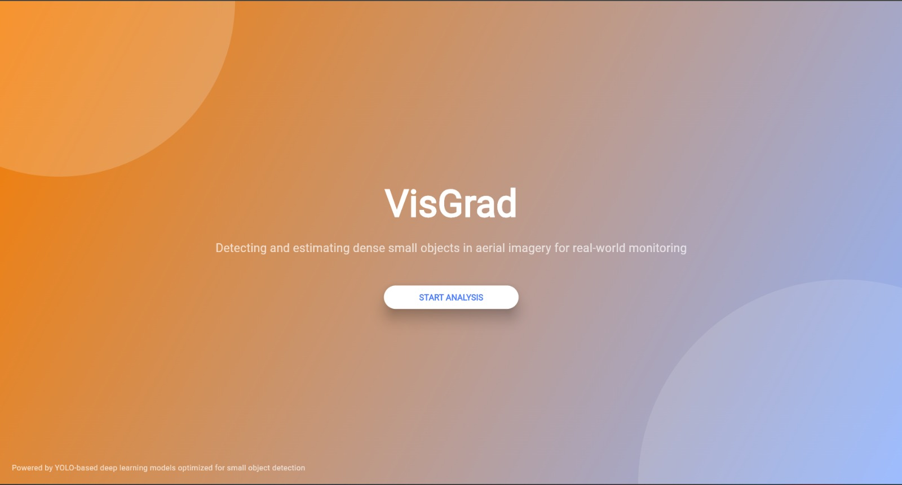
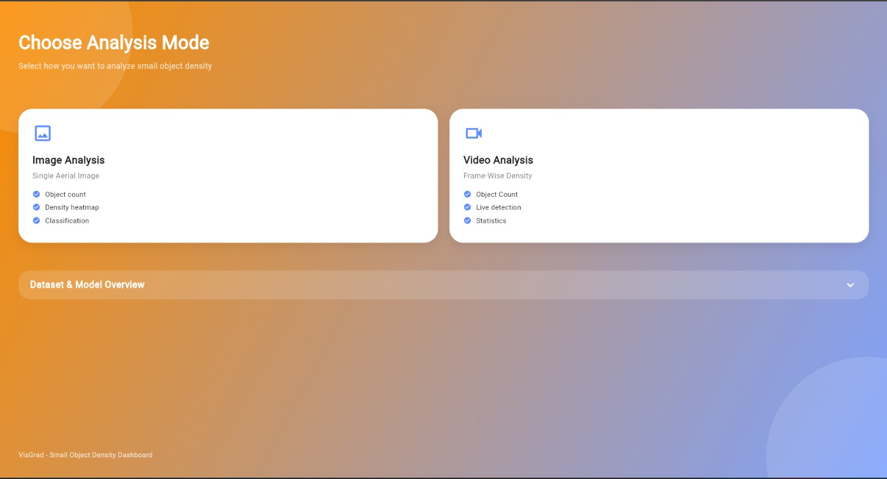
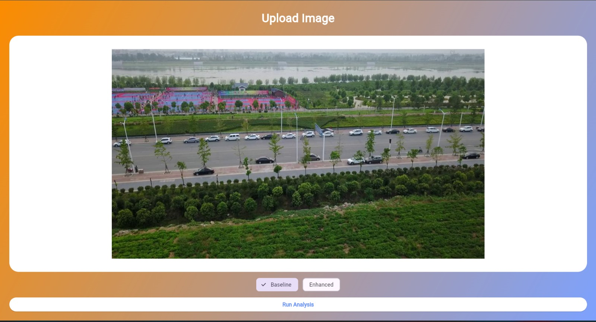
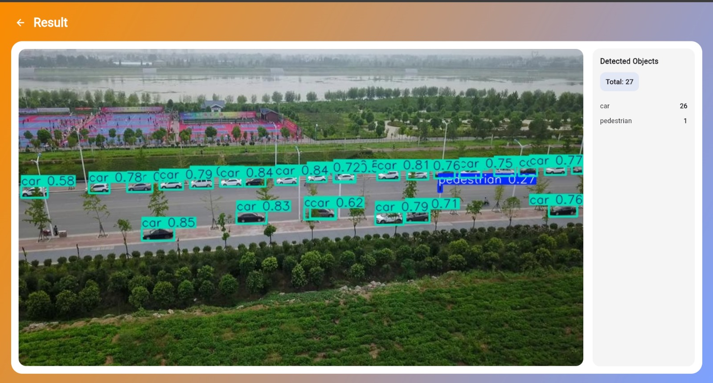

# 🛰️ VisGrad-YOLO  
## Small Object Detection Web Application (Flutter + YOLOv8)

A **Flutter Web–based object detection system** designed specifically for **small-object detection** using:

- 🔹 Baseline YOLOv8
- 🔹 Enhanced VisGrad-YOLO (Backbone + Neck + Head Improvements)

The application provides an interactive web interface where users can upload **images or videos**, run detection, and visualize predictions with bounding boxes.

✅ Frontend/UI Completed  
🚧 Backend Model Inference Integration In Progress  

---

# 📖 About the Project

Small-object detection is critical for modern surveillance, traffic monitoring, and remote sensing applications. However, detecting tiny targets remains challenging due to:

- low resolution  
- cluttered backgrounds  
- feature loss in deeper layers  
- significant scale variations  

Conventional object detectors often fail to capture fine-grained details, resulting in missed detections and poor recall.

To address these limitations, we propose **VisGrad-YOLO**, an enhanced and explainable detection framework built upon the **YOLOv8 architecture**. The system introduces improvements across the **backbone, neck, detection head, post-processing, and optimization stages** to strengthen feature representation while maintaining real-time performance.

---

# 🔬 Key Architectural Enhancements

## 🔹 Backbone – C2f-CloAtt
- Replaces standard YOLOv8 backbone blocks  
- Combines **C2f (Cross-Stage Feature Fusion)** with **CloAtt (Closed Attention)**  
- Preserves low-level spatial information  
- Improves fine-grained feature extraction  
- Enhances tiny object visibility  

## 🔹 Neck – AGBiFPN + SOCS
- **AGBiFPN** for adaptive bidirectional multi-scale fusion  
- **SOCS modules** for contextual refinement  
- Strengthens shallow–deep feature interaction  
- Improves small-object representation  

## 🔹 Post-Processing
- Small-object-aware confidence boosting  
- Gentler Non-Maximum Suppression (NMS)  
- Prevents removal of closely packed objects  

## 🔹 Optimization Strategy
- Advanced IoU losses (RIoU & SIoU)  
- Scale-balanced label assignment  

---

### 🚀 Result

These combined improvements significantly increase:

- Recall  
- mAP  
- Localization precision  

especially for **tiny and distant objects**, compared to baseline YOLOv8.

---

# 🔍 Explainability

To improve model transparency, the system integrates:

- Grad-CAM attention heatmaps  
- Detection-aware visualization  

These highlight regions influencing predictions, making the detector more **interpretable and trustworthy**.

---

# 🌐 Web Application Features

✅ Flutter Web responsive UI  
✅ Image detection mode  
✅ Video detection mode  
✅ Baseline vs Enhanced model selection  
✅ Detection results visualization  
✅ Modular routing architecture  
✅ Real-time preview workflow  

---

# 🧠 System Workflow

```

User Upload (Image/Video)
↓
Backend API (Planned)
↓
YOLOv8 / VisGrad-YOLO Inference
↓
Bounding Boxes + Labels
↓
Results Displayed in Web UI

```

---

# 🛠️ Tech Stack

| Layer | Technology |
|-----------|-------------|
| Frontend | Flutter Web |
| Model | YOLOv8 |
| Enhancements | C2f-CloAtt + AGBiFPN + SOCS |
| Backend (Planned) | FastAPI / Flask |
| Image Processing | OpenCV |
| Visualization | Grad-CAM |

---

# 📂 Project Structure

```

lib/
┣ screens/
┃ ┣ intro_screen.dart
┃ ┣ mode_selection_screen.dart
┃ ┣ image_detection_screen.dart
┃ ┣ video_detection_screen.dart
┃ ┗ result_screen.dart
┣ router.dart
┗ main.dart

assets/
┗ screenshots/

android/
test/
pubspec.yaml
README.md

````

---

# 📸 Website Screenshots

<table>
<tr>
<td width="50%">

### 🏠 Intro Page


</td>
<td width="50%">

### ⚙️ Mode Selection


</td>
</tr>

<tr>
<td width="50%">

### 🖼️ Image Detection


</td>
<td width="50%">

### 🎥 Video Detection


</td>
</tr>

<tr>
<td colspan="2">

### 📊 Results Screen


</td>
</tr>
</table>

---

# ⚙️ Installation

## 1. Clone Repository
```bash
git clone https://github.com/vigu2019/mainproj.git
cd your-repo-name
````

## 2. Install Dependencies

```bash
flutter pub get
```

## 3. Run Web App

```bash
flutter run -d chrome
```

---

# 📈 Current Status

| Module                  | Status      |
| ----------------------- | ----------- |
| UI/Frontend             | ✅ Completed |
| Routing                 | ✅ Completed |
| Image Upload            | ✅ Completed |
| Detection Visualization | ✅ Completed |
| Video Upload            | 🚧 Completed |
| Backend API             | 🚧 Pending  |
| Model Deployment        | 🚧 Pending  |

---

# 🎯 Future Work

* Backend inference API integration
* Real-time video streaming
* Cloud deployment
* Performance analytics dashboard
* Authentication & alerts
* Mobile version

---

# 👩‍💻 Team Contributions

* Flutter Web UI Development
* YOLOv8 Baseline Implementation
* C2f-CloAtt Backbone Design
* AGBiFPN + SOCS Neck Integration
* Small-object–aware Post-processing head 
* Loss Function Optimization
* Visualization & Evaluation

---

# 📜 License

Developed for academic and research purposes.

---

# ⭐ Acknowledgement

Built upon the YOLOv8 framework and extended with custom architectural improvements for robust small-object detection.
